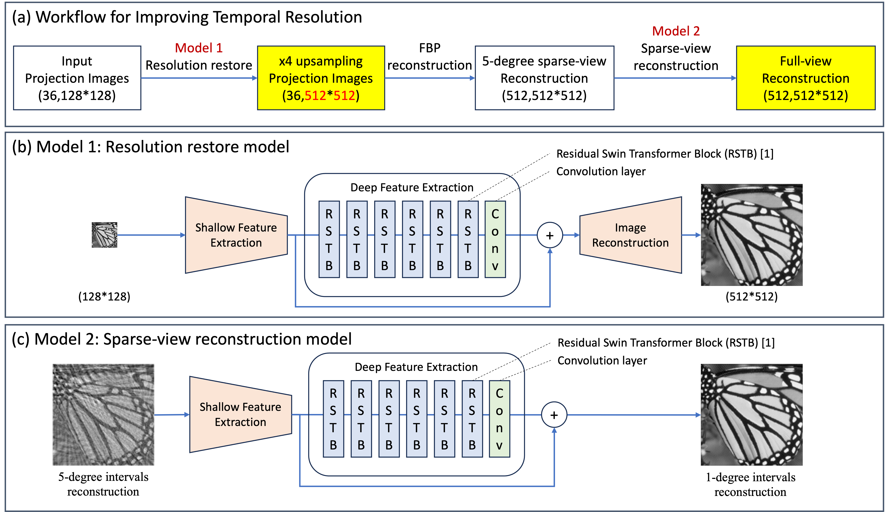
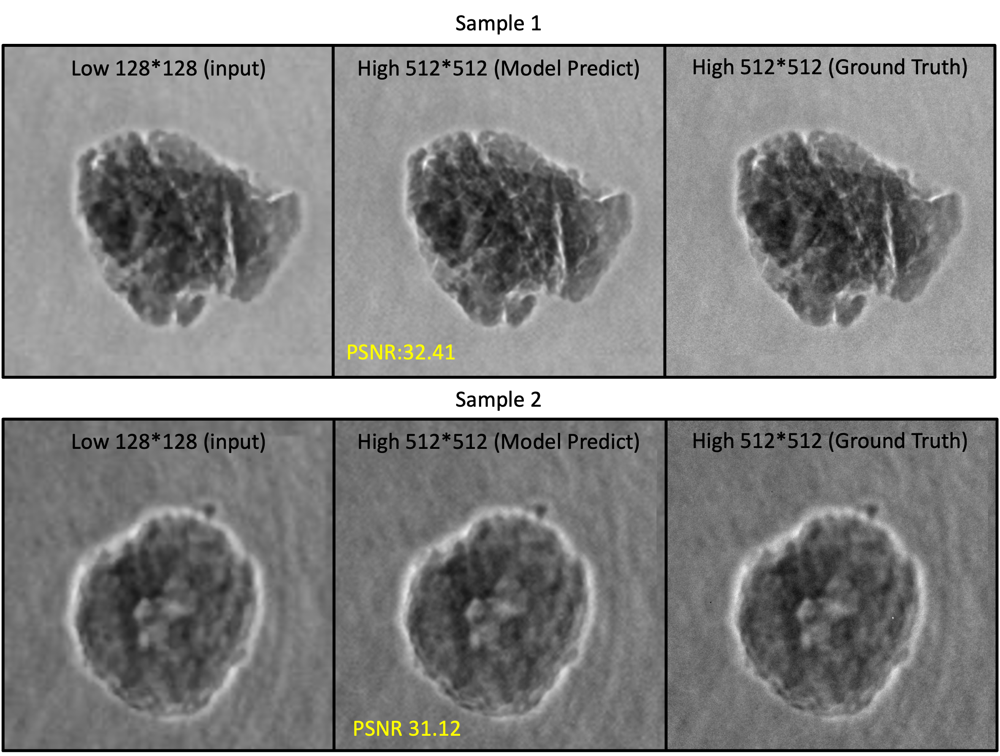
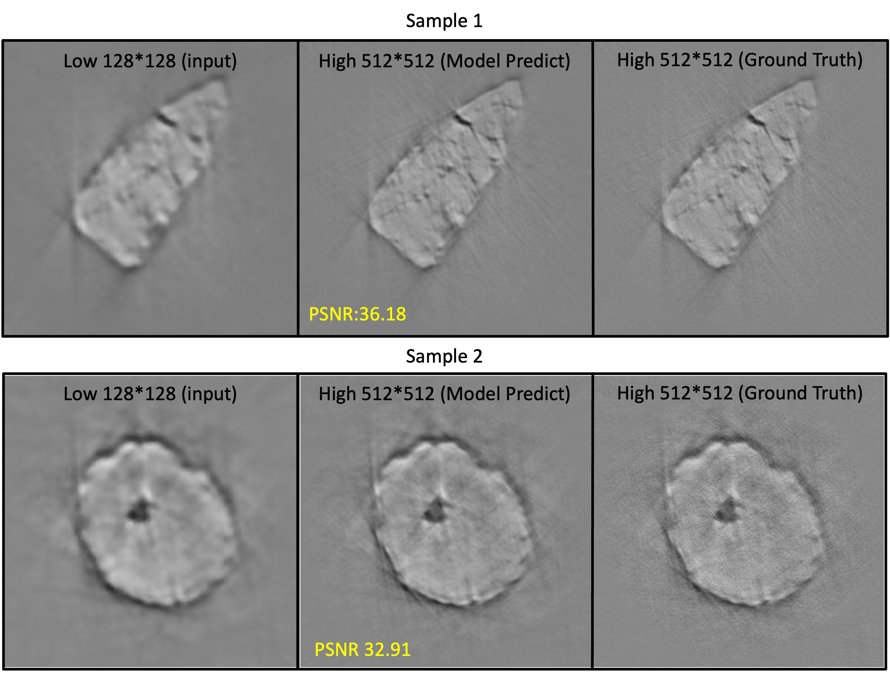

# A-Strategy-for-Improving-Temporal-Resolution-in-X-ray-Tomography-Using-Deep-Learning
Tai-Yue Li and Chun-Chieh Wang

TLS BL01B1 beamline, National Synchrotron Radiation Research Center, Hsinchu, Taiwan

## Overview
We introduce a method to enhance the temporal resolution of XCT without increasing radiation intensity by using pixel binning to shorten exposure times and sparse-view acquisition to reduce image count. Our approach utilizes deep learning models based on SwinIR architecture to correct resolution degradation and minimize streak artifacts in sparse-view reconstructions. 

We apply a resolution restore model for spatial resolution improvement from x4 downsampled images, followed by sparse-view reconstruction using Filtered Back Projection at 5-degree intervals. This is enhanced by a sparse-view restore model to further reduce streak artifacts. Tested with simulation data and Taiwan Light Source TLS 01B1 data, our method significantly improves image quality, reduces tomography scan time by about 80 times, boosts equipment efficiency, and facilitates the study of dynamic 3D structures.

## Method

### Model 1: Image Resolution restore model



### Model 2: Sparse-view reconstruction model



## Environment
### 
```
CUDA_VISIBLE_DEVICES=0,1,2,3,4,5,6,7 python -m torch.distributed.launch --nproc_per_node=8 --master_port=4321 drct/train.py -opt options/train/train_DRCT_SRx2_from_scratch.yml --launcher pytorch
```

## How to Inference
```
CUDA_VISIBLE_DEVICES=0,1,2,3,4,5,6,7 python -m torch.distributed.launch --nproc_per_node=8 --master_port=4321 drct/train.py -opt options/train/train_DRCT_SRx2_from_scratch.yml --launcher pytorch
```
## Citations
If our work is helpful to your reaearch, please kindly cite our work. Thank!

## Thanks
A part of our work has been facilitated by [SwinIR](https://github.com/JingyunLiang/SwinIR) framework, and we are grateful for their outstanding contributions.

Thank the National Center for High-performance Computing of
Taiwan for providing computational and storage resources.


## Contact
If you have any question, please email tim312508@gmail.com to discuss with the author.


